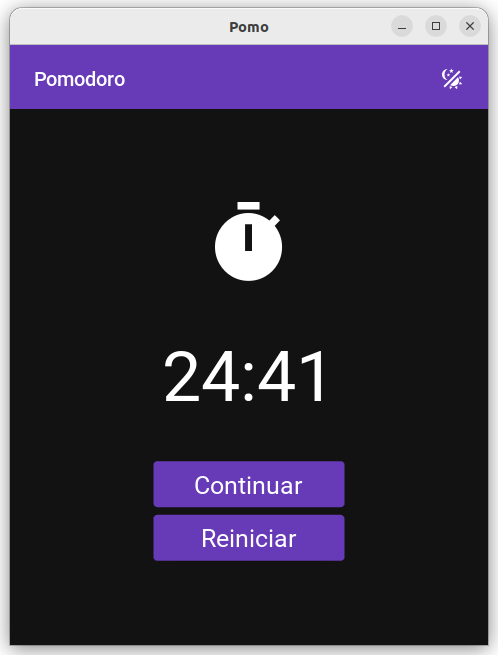

# PomoApp

Aplicativo que simula o relógio Pomodoro nos intervalos, 25 minutos, 5 minutos, 25 minutos, 5 minutos, 25 minutos e 30 minutos em um ciclo.

## Imagens.

## Objetivo do projeto.

Testar funcionalidade da lib KivyMD e as possibilidades de desenvolvimento mobile com python.

## Funcionalidades.

### Iniciar.

Começa a drecrementar o tempo marcado na tela quando este tempo chega em "0" é iniciada novo ciclo.

### Pausar.

Pausa contagem permitindo ação de continuar o ciclo atual ou reiniciar os ciclos desde o inicio.

### Continuar.

Continua o ciclo atual.

### Reiniciar.

Inicia um novo conjunto de ciclos desde o começo.

### Trocar Tema.

Permite alterar tema entre "Escuro" e "Claro".
